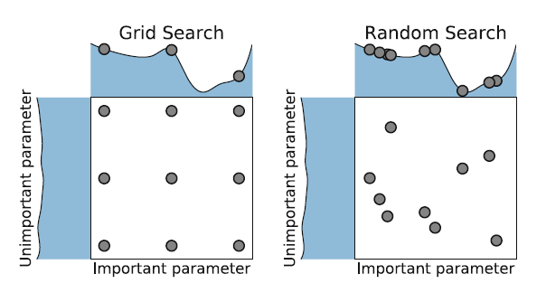

# Hyperparameter Optimization

---
## Intro

- Every machine learning has *hyperparameters*. 
- Tuning hyperparameters is, at the very least, annoying.
- True end-to-end learning should not require a costly expert playing around with hyperparameters!

---
## Definition: Hyperparameter optimization (HPO)

- $D = (D_{train}, D_{valid})$ our data
- $A$ an algorithm
- $\Lambda$ the set of possible hyperparameters (configuration space)
- $\mathcal{L}(A_\lambda,D_{train}, D_{valid})$ loss function of $A$, with $\lambda \in \Lambda$. 
- **Goal:** find $\lambda^*$ such that:

$$ \lambda^* \in \mathrm{argmin}_{\lambda \in \Lambda}\mathcal{L}(A_\lambda,D_{train}, D_{valid}).$$


--- 
## Devil in the details
- The reality is that we often have a **complex configuration space** with a mixture of continuous, integer, categorical and conditional components.

---
## Configuration space (cont.)
- Continuous
	- Learning rates (e.g. in deep learning).
- Integer
	- Number of trees in GBM/random forests.
- Categorical
	- Activation functions (ReLU, LeakyReLU, $\tanh$).
	- Operator ($\mathrm{conv}3\times3$, max pool layer).
- Conditional
	- Hyperparams that are only available if something else was chosen (e.g. number of trees if classifier = RF).


---
## Def: Combined Algorithm Selection and Hyperparameter Optimization (CASH)

- $D = (D_{train}, D_{valid})$ our data
- $\mathcal A = \{A_1, A_2, \ldots A_n\}$ a set of algorithms.
- $\Lambda_i$ the configuration space for $A_i$.
- $\mathcal{L}(A_{i,\lambda},D_{train}, D_{valid})$ loss function of $A_i$, with $\lambda \in \Lambda_i$. 
- **Goal:** find $A_*, \lambda^*$ such that:

$$ A_{*,\lambda^*} \in \mathrm{argmin}_{i, \lambda \in \{1, 2, \ldots n\}\times \Lambda}\mathcal{L}(A_{i,\lambda},D_{train}, D_{valid}).$$

---
## Approaches
- Black-box Optimization.
- Bayesian Optimization.
- Sequential Model-based Algorithm Configuration (SMAC).
- Tree-structured Parzen Estimator (TPE).

---
## Black-box Optimization
- Ignore everything, focus on minimizing $\mathcal{L}(\lambda)$. 
- Two alternatives: grid search, (pure) random search.

---
## Grid search
- The user provides a range of values for each hyperparameter.
- The function is evaluated in the Cartesian product of these lists.
- Number of function evaluations grows exponentially with the dimension of the hyperparameter space: if you have $n$ hyperparameters and choose two values, you already need $2^n$ evaluations!.

---
## Random search
- The user provides a range of values for each hyperparameter.
- The function is evaluated in a sample over the cartesian product.
- Easier parallelization.
- Useful baseline, since it does not make any assumptions on the underlying machine learning algorithm being used.
- Can do better than grid search:


---
## Population-based methods
- Not random search (?).
- Genetic algorithms, evolutionary algorithms, evolutionary strategies, particle swarm optimization.
- [CMA-ES (covariance matrix adaption evolutionary strategy).](https://arxiv.org/pdf/1604.00772.pdf)
- [Natural Evolution Strategies.](http://people.idsia.ch/~tom/publications/nes.pdf)


---
## Cross-Entropy Method (CEM)
```
for it in range(n_iter):
    # Sample parameter vectors
    las = np.random.normal(la_mean, la_std, (bsize,dim_la))
    rewards = [f(la) for la in las]
    # Get elite parameters
    n_elite = int(batch_size * elite_frac)
    elite_ids = np.argsort(rewards)[bsize-n_elite:bsize]
    elite_las = [las[i] for i in elite_ids]
    # Update la_mean, la_std
    la_mean = np.mean(elite_las,axis=0)
    la_std = np.std(elite_las,axis=0)
    print(solution, la_mean)
```    

---
# Beyond random search

---
## Bayesian Optimization
- Two key ingredients:
	- a probabilistic surrogate model.
	- an acquisition function to decide which point to evaluate next. 
- A popular candidate for acquisition function is the *expected improvement*.

---
## Bayesian Optimization (cont.)

- In each iteration, the surrogate model is fitted to all observations of the target function made so far.
- Then the acquisition function determines the utility of different candidate points. 
- Compared to evaluating the expensive blackbox function, the acquisition function is cheap to compute and can therefore be thoroughly optimized.

---
## Example: Random search vs Gaussian Processes


---
# Beyond Bayesian Optimization

---
## Downsides of BO
- Scale cubically in the number of data points.
- Hard to parallelize, unlike random search or many black-box methods.
- Focus instead on hyperparameter *evaluation* rather than *selection*.

---
## Successive halving
- **Idea:** Kill dead ends quickly. 
- Try $n$ hyperparameters for some fixed time $T$. 
- Then keep the $n/2$ best hyperparameter settings and run for time $2T$. 
- Repeating this $r$ times, we end up with $n/2^r$  configurations.
- We get exponentially more time for testing better configurations.


---
## Successive halving (cont.)
- **Downside:** Some configurations can be bad on the beginning, but then improve. An impatient algorithm will not find them.
- In practice, we find that:
	- Sometimes we need more time to test few configurations.
	- Some other times we need to test more configurations for less time.

---
## Hyperband
- **Idea:** do grid search over $n$, the amount of hyperparameter configurations.
- All configurations get a minimum amount of resources at the beginning, before being discarded.
- As you reduce the number of configurations, the testing time increases.

---
## Results 
- Training LeNet on CIFAR-10, MNIST and SVHN.
- Hyperband is 20x faster than random search, second best competitor is 7x faster.
- **Warning:** Computation budget of 1 year of GPU hours.

---
## References

- [Successive halving implementation in sklearn.](https://github.com/benoitdescamps/Hyperparameters-tuning/blob/master/HyperBand-SuccessiveHalving/Hyperband/Examples/example_sklearn_random_forest.py)
- [Comparison between Hyperband and Successive Halving](https://www.argmin.net/2016/06/23/hyperband/)
- [Hyperband Implementation](https://gist.github.com/PetrochukM/2c5fae9daf0529ed589018c6353c9f7b).
- [Original Hyperband paper](https://arxiv.org/pdf/1603.06560.pdf)
- [Blog post from Hyperband authors.](https://homes.cs.washington.edu/~jamieson/hyperband.html)