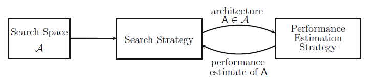

# Neural Architecture Search

---
## Motivation
- Deep Learning has brought up big progress on:
	- Image recognition.
	- Speech recognition.
	- Machine translation.
- However, employed architectures are developed by human experts.
- **Can we do better?**

---
## NAS vs HPO
- We can do HPO on neural networks and find configurations for learning rates and activation functions, for instance, *if we have a fixed architecture*.
- NAS is concerned with finding the right architecture: HPO comes later as a subroutine.

---
## NAS methods
- **Search Space:** Which architectures can be represented? Incorporates prior knowledge from experts.
- **Search Strategy:** Given the search space, how to explore it? We find ourselves in an exploration-exploitation tradeoff.
- **Performance Estimation:** Since standard training and validation loops are expensive, there is interest in methods that can reduce the cost of performance estimations.

---
## NAS methods (cont.)

---
## Search Space
- Specifying the parameter space:
	- Maximum number of layers.
	- Type of operation (pooling, convolution, etc).
	- Hyperparameters associated to the type of operation.
- Gets more complicated in the presence of modern design elements, such as skipping connections and multiple paths.

---
## Search Space (cont.)

---
## Search Space: Motifs instead of layers.

---
## Search Space: Motifs instead of layers.
- Defining the search space in terms of motifs can greatly reduce complexity.
- Search is instead performed on a low-dimensional lattice.

---
## Search Strategy
- Our good old friends:
	- Random search.
	- Bayesian Optimization.
	- Evolutionary methods.
- Gradient-based methods:
	- Convexification of the hyperparameter space.

---
## NAS as a RL problem
- **Action:** Generation of a neural network architecture.
- **Action space:** Search space of architectures.
- **Reward:** Cross validation error.
- Since no state is observed, the RL problem is actually a multi-armed bandit problem.

---
## Search Strategy (cont.)
- No clear winner: the jury is still out there to find the best algorithm.
- Approaches relying on Bayesian Optmization methods seem more competitive here, and some preliminary results indicate this could be the winner.
- AlphaGo team used Bayesian Optimization at several stages.

---
## Performance Estimation Strategy
- Training and evaluation of every architecture from scratch gives computational demands in the order of thousands of GPU days!
- Better idea: evaluate a proxy instead.

---
## Performance Estimation Strategy (cont.)
- **Lower fidelities:** Evaluate a network architecture on:
	- A subset of the data.
	- Lower-resolution (in the case of images).
	- Shorter training times.
- If the relative ranking does not change too much, this method works. 
- However, too much noise shows in practice that the ranking can oscillate a lot.

---
## Performance Estimation Strategy (cont.)
- Weight initialization. Reuse the architecture from task A in task B, potentially modifying some layers.
- One-shot architecture search: treat all possible architectures as subgraphs of a common graph, and share weights across them.
- Regardless of methods, the understanding of *why* some architectures actually work better than others is still a largely open problem.
